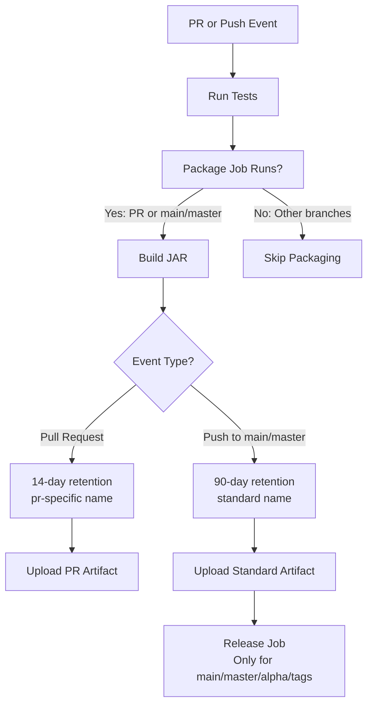

# Pull Request Artifacts Implementation

## Overview
This document describes the implementation of build artifacts for pull request testing, addressing issue #24.

## Changes Made

### 1. Updated CI/CD Workflow (`.github/workflows/ci.yml`)

#### Modified Package Job Condition
```yaml
# Before
if: github.ref == 'refs/heads/main' || github.ref == 'refs/heads/master'

# After  
if: github.ref == 'refs/heads/main' || github.ref == 'refs/heads/master' || github.event_name == 'pull_request'
```

#### Added Conditional Artifact Logic
- **PR Artifacts**: 14-day retention, named `poker-game-jar-pr-{PR_NUMBER}`
- **Main/Master Artifacts**: 90-day retention, named `poker-game-jar`

### 2. Artifact Behavior

| Event Type | Retention | Artifact Name | Purpose |
|------------|-----------|---------------|---------|
| Pull Request | 14 days | `poker-game-jar-pr-{PR_NUMBER}` | PR testing and review |
| Push to main/master | 90 days | `poker-game-jar` | Releases and long-term storage |

### 3. Workflow Flow



## Benefits

### ✅ Requirements Met
- **Build artifacts available in PRs**: JAR files are now built and uploaded for every PR
- **2-week retention**: PR artifacts automatically expire after 14 days
- **Review-friendly**: Each PR gets uniquely named artifacts to avoid conflicts

### ✅ Backward Compatibility  
- Main/master branch behavior unchanged
- Release workflow unaffected
- Existing artifact retention maintained for releases

### ✅ Resource Efficiency
- PR artifacts have shorter retention (14 vs 90 days)
- Unique naming prevents artifact conflicts
- No unnecessary artifacts for feature branches

## Usage

### For PR Reviews
1. Open any pull request targeting main/master
2. Wait for CI/CD to complete
3. Download JAR artifact from the "Actions" tab
4. Test the built application locally

### For Releases
- No changes to existing release process
- Main/master artifacts still used for GitHub releases
- 90-day retention maintained for release artifacts

## Technical Details

### Artifact Naming Convention
- **PR Artifacts**: `poker-game-jar-pr-{PR_NUMBER}`
  - Example: `poker-game-jar-pr-123` for PR #123
- **Release Artifacts**: `poker-game-jar` (unchanged)

### Retention Policies
- **PR artifacts**: 14 days (meets requirement)
- **Release artifacts**: 90 days (existing policy maintained)

This implementation provides the requested functionality with minimal changes and full backward compatibility.